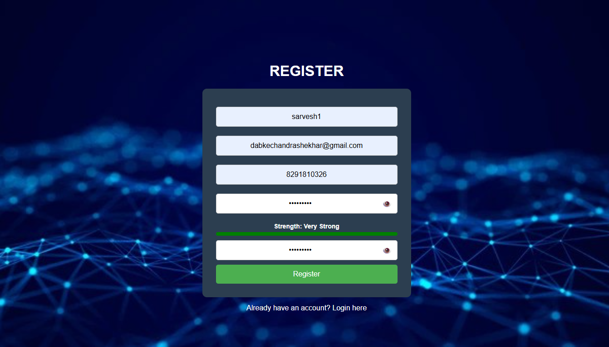
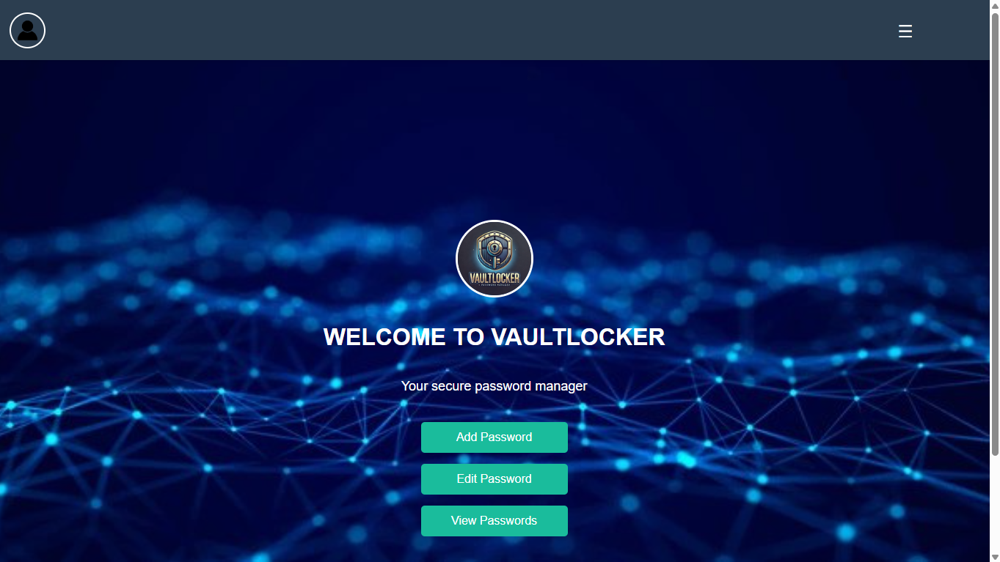
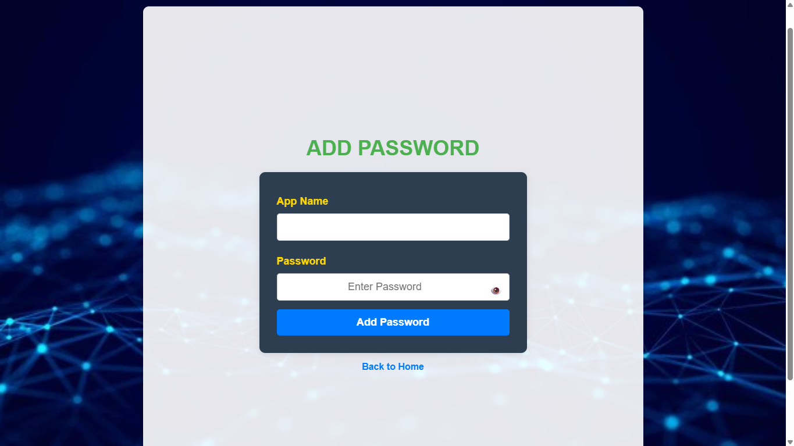
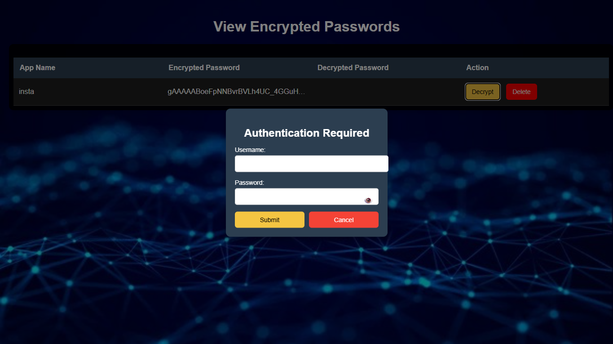
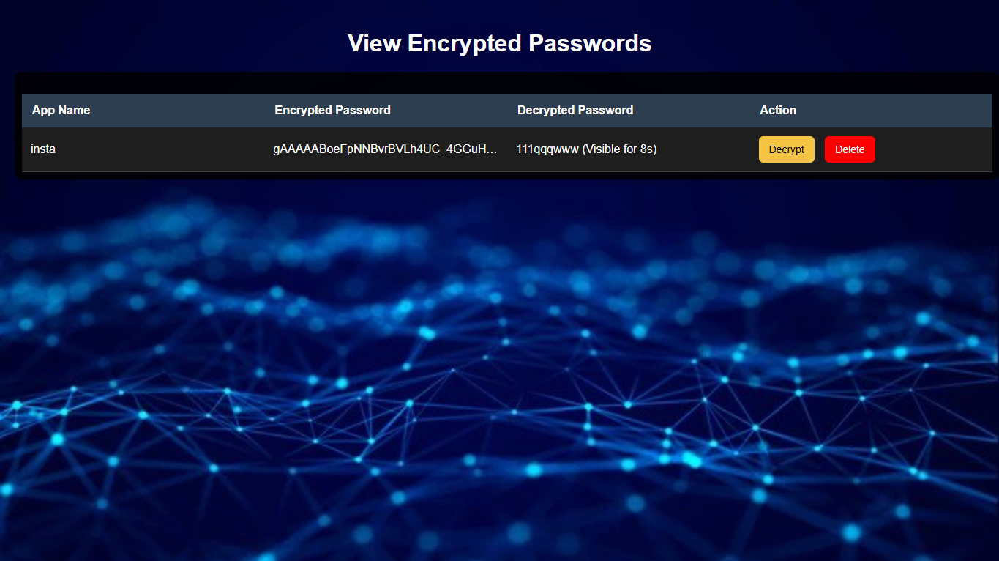
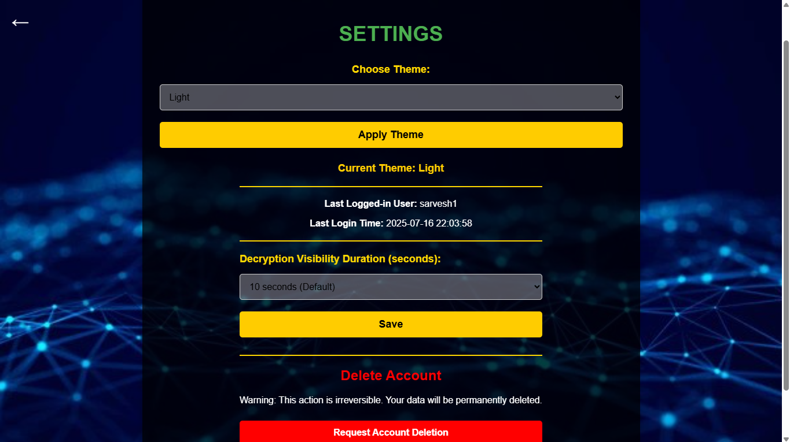

# 🔐 VaultLocker – Your Secure Password Manager

VaultLocker is a secure, modern, and easy-to-use password manager built using **Flask**, **SQLite**, **HTML/CSS**, and **JavaScript**. It encrypts and stores your passwords safely and allows you to access them with OTP-based login and optional device-level access control.

---

## ✨ Features

- 🔒 AES-encrypted password storage
- 🧾 OTP-based authentication via email
- 🖥️ Login activity logs with IP and device details
- 🚫 Copy-paste restriction for password fields
- ⚙️ Access control: allow only trusted devices
- ❌ Option to delete your account permanently
- 🌓 Light/Dark theme toggle
- 📂 Organized UI with search and categories

---

## 🛠️ Tech Stack

- **Frontend:** HTML5, CSS3, JavaScript  
- **Backend:** Python Flask  
- **Database:** SQLite  
- **Security:** AES Encryption, OTP via email, Flask sessions

---

## 📁 Project Structure
VaultLocker/
├── static/
│ ├── css/
│ ├── js/
│ └── images/
├── templates/
│ ├── login.html
│ ├── register.html
│ ├── dashboard.html
│ ├── settings.html
├── database/
│ └── vault.db
├── app.py
├── auth.py
├── utils.py
├── requirements.txt
└── README.md

---

## 🚀 How to Run Locally

1. Clone the repository:
   git clone https://github.com/sarveshdabke/vaultlocker_app
   cd vaultlocker
2. Create and activate a virtual environment:
   python -m venv venv
   source venv/bin/activate  # On Windows: venv\Scripts\activate
3. Install dependencies:
   pip install -r requirements.txt
4. Run the app:
   python app.py
5. Open your browser and go to:
   http://localhost:5000

🔐 Security Overview
AES encryption protects stored passwords

OTP (One-Time Password) for secure login

Copy-paste disabled on sensitive fields

Session-based authentication

IP & device tracking on login attempts

Optional login restrictions for untrusted devices

#### 📝 Registration Page

---

#### 🧭 Dashboard

---

#### ➕ Add Password Page

---

#### 🔐 View Password – Authentication Step

---

#### 👁️ View Password Page

---

#### ⚙️ Settings Page

📌 Future Improvements
Multi-factor authentication (MFA)

Password generator tool

Browser extension for autofill

Cloud backup and restore

User analytics dashboard

📄 License
This project is licensed under the MIT License.
See the LICENSE file for details.

👤 Author
Developed by Sarvesh C. Dabke
🔗 GitHub: https://github.com/sarveshdabke
